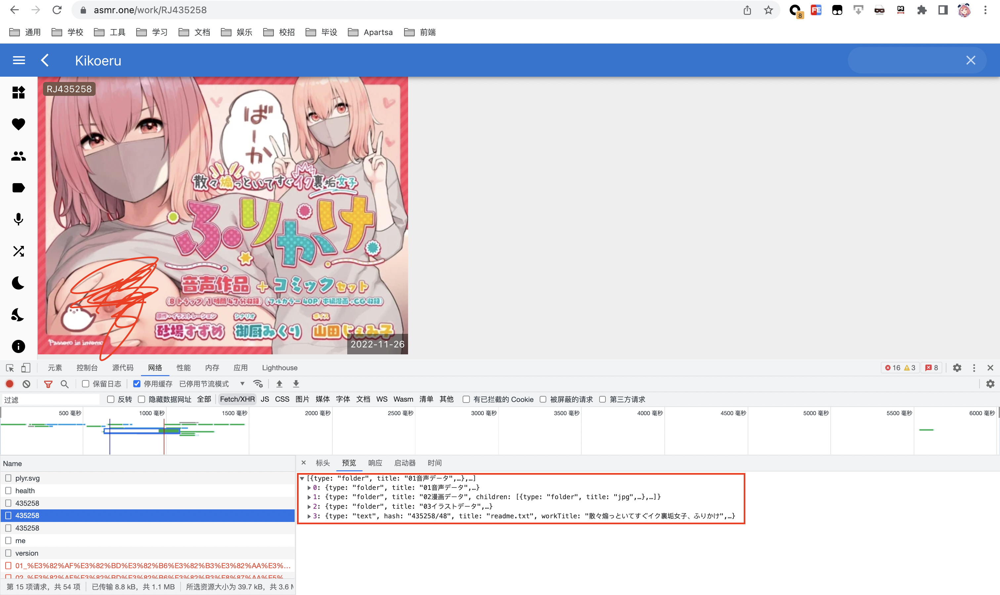

# asmr.one自动下载

运行：
* 把test.json替换成asmr.one抓包XHR的json：f12 -> 网络 -> 筛选Fetch/XHR -> 找到如下图中这个json -> 粘贴到test.json里
  
* 装deno：[Installation | Manual | Deno](https://deno.land/manual@v1.28.2/getting_started/installation)
* 终端：`deno run --allow-read --allow-write --allow-net main.ts test.json`
* 如果卡住了需要给终端开下梯子，`export HTTPS_PROXY=你梯子的proxy`
